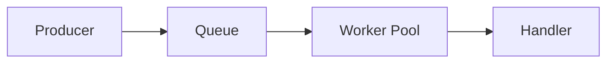
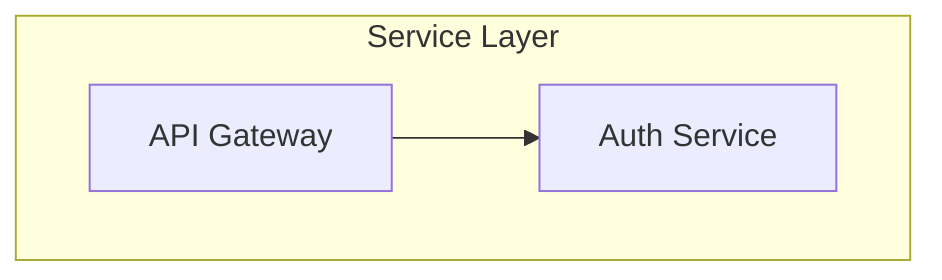
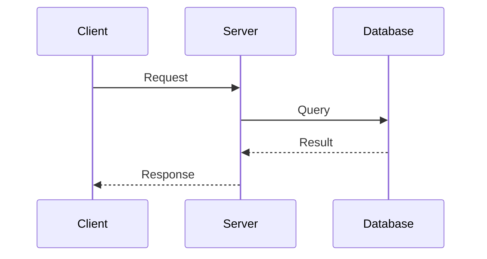
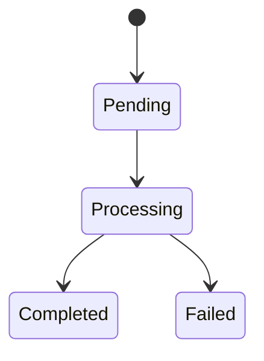

# Write Technical Blog Post

Create a crisp, practical technical blog post explaining this project to a technical audience.

---

## Role

Write as a seasoned technical architect sharing real-world experience — clear, confident, and grounded.

---

## Tone & Style

**Do:**
- Natural, human voice
- Professional and concise
- First-person plural ("we") or neutral tone
- Explain concepts clearly without fluff
- Short, purposeful sentences

**Don't:**
- Marketing buzzwords or hype
- AI-sounding phrases or patterns
- Emojis or exclamation marks
- Overly casual or overly formal
- Exaggerated claims

---

## Structure

### 1. Title
Descriptive and straightforward. Not clickbait.

```markdown
# Building a High-Performance Job Queue in Go
```

### 2. Introduction
- What the project does
- Why it exists
- What problem it solves
- Who it's for

### 3. Rationale
- Motivation behind the design
- Why existing solutions weren't sufficient
- Key constraints or requirements

### 4. Value Proposition
What makes it worth using:
- Simplicity
- Performance
- Flexibility
- Maintainability
- Developer experience

### 5. Architecture Overview
Include a **Mermaid diagram** showing:
- Core components
- Data flow
- Key interactions

```markdown

```

### 6. Usage Examples
Clear code snippets showing:
- Basic setup
- Common patterns
- Configuration options

### 7. Key Design Decisions
Explain important trade-offs:
- What was chosen and why
- What was explicitly avoided
- Lessons learned

### 8. Real-World Applications
- Where it fits in typical architectures
- Example use cases
- Integration patterns

### 9. Conclusion
- When to use it
- When not to use it
- Potential extensions or future work

---

## Formatting

- Markdown throughout
- Syntax-highlighted code blocks
- Proper section headers (`##`, `###`)
- One or more Mermaid diagrams
- Tables for comparisons

---

## Output

Save as: `docs/TECHNICAL_BLOG.md`

Ready for direct publication or review.

---

## Example Outline

```markdown
# [Project Name]: [Subtitle]

## Introduction

[What problem we're solving and why it matters]

## The Problem

[Specific challenges that led to building this]

## Our Approach

[High-level solution overview]

## Architecture

```mermaid
[Diagram]
```

[Explanation of components]

## Implementation

### Core Concepts

[Key abstractions and patterns]

### Example Usage

```go
[Code example]
```

## Design Decisions

| Decision | Choice | Rationale |
|----------|--------|-----------|
| [Topic] | [What we chose] | [Why] |

## Performance

[Benchmarks or performance characteristics]

## When to Use This

**Good fit:**
- [Use case 1]
- [Use case 2]

**Not ideal for:**
- [Anti-pattern 1]
- [Anti-pattern 2]

## Conclusion

[Summary and call to action]
```

---

## Mermaid Diagram Types

**Architecture:**


**Sequence:**


**State:**


---

*Technical depth, practical focus.*
