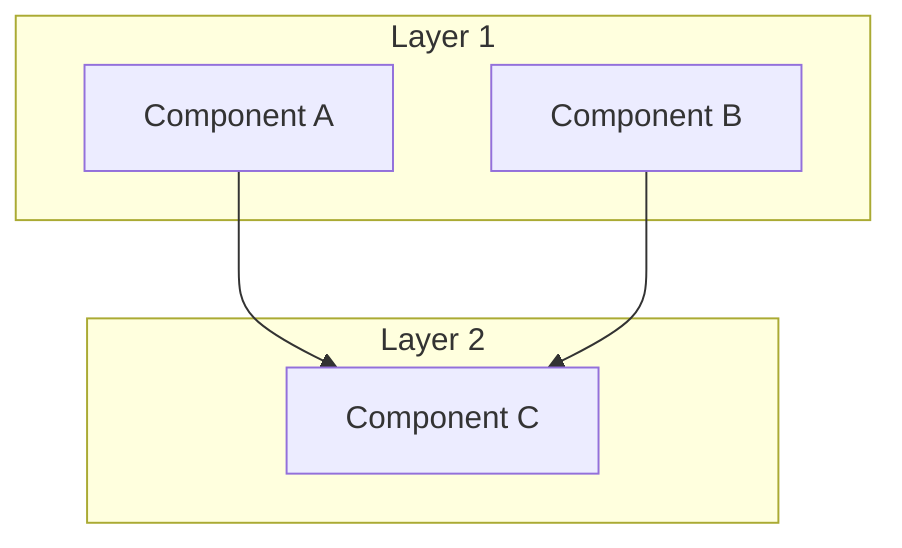
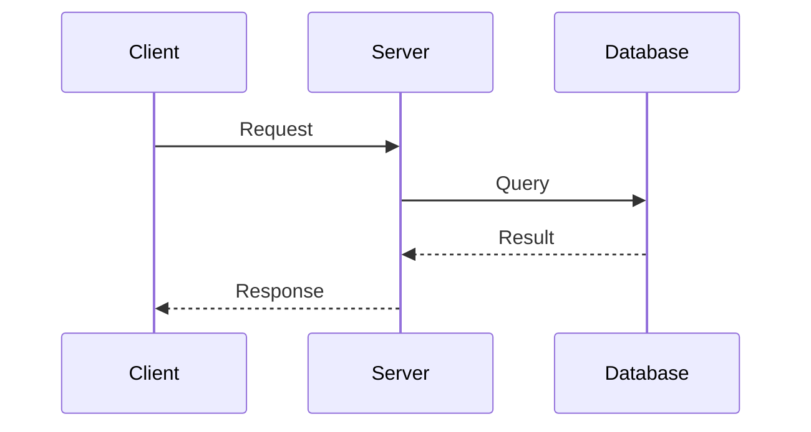
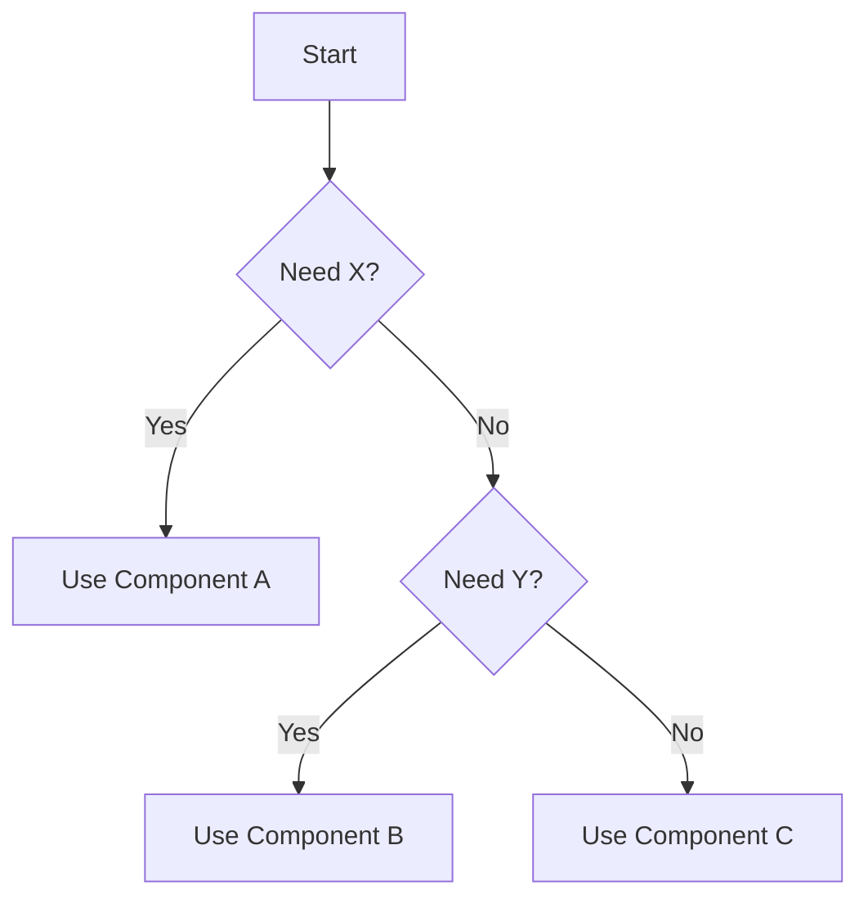
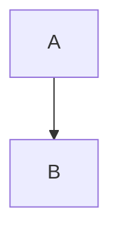

# Documentation Site Setup

Transform project documentation into a professional, publicly consumable static site with CI/CD deployment.

**Mindset:** Documentation sites are the public interface to your project. Apply `/pb-preamble` thinking (organize for scrutiny, make assumptions visible) and `/pb-design-rules` thinking (Clarity: obvious navigation; Simplicity: minimal configuration; Robustness: automated deployment).

**Resource Hint:** sonnet — documentation site setup follows established SSG patterns and CI/CD templates

---

## When to Use

**Transformation (existing docs):**
- Project has markdown docs ready for public consumption
- Preparing for open source release or public launch
- Documentation needs professional presentation

**Greenfield (new project):**
- Starting a new project that will need public docs
- Setting up documentation infrastructure early
- Establishing documentation patterns for the team

---

## Architecture Overview

```
                    DOCUMENTATION SITE
+---------------------------------------------------------------+
|                                                               |
|  +-------------+  +-------------+  +------------------------+ |
|  |  Landing    |  |  Guides     |  |  Reference             | |
|  |  Page       |  |             |  |                        | |
|  |             |  |  - Start    |  |  - API (external link) | |
|  |  - Install  |  |  - Feature1 |  |  - Decision Guide      | |
|  |  - Quick    |  |  - Feature2 |  |  - Migration           | |
|  |    Example  |  |  - Feature3 |  |  - Changelog           | |
|  +-------------+  +-------------+  +------------------------+ |
|                                                               |
|  +-----------------------------------------------------------+|
|  |  Hero Narrative (building-project.md)                     ||
|  |  - Design philosophy, architecture, trade-offs            ||
|  |  - Mermaid diagrams, code examples                        ||
|  +-----------------------------------------------------------+|
|                                                               |
|  +-------------+  +-------------+                             |
|  | Contributing|  |  Security   |                             |
|  +-------------+  +-------------+                             |
|                                                               |
+---------------------------------------------------------------+
```

---

## CI/CD Deployment Flow

```
+------------------+
|  docs/** change  |
+--------+---------+
         |
         v
+------------------+     +------------------+
|  Push to main    |---->|  GitHub Actions  |
+------------------+     |  triggered       |
                         +--------+---------+
         +------------------------+------------------------+
         |                                                 |
         v                                                 v
+------------------+                            +------------------+
|  PR to main      |                            |  Push to main    |
|  (validation)    |                            |  (deployment)    |
+--------+---------+                            +--------+---------+
         |                                               |
         v                                               v
+------------------+                            +------------------+
|  Build only      |                            |  Build + Deploy  |
|  (no deploy)     |                            |  to GitHub Pages |
+------------------+                            +--------+---------+
                                                         |
                                                         v
                                                +------------------+
                                                |  Site live at    |
                                                |  user.github.io/ |
                                                |  project/        |
                                                +------------------+
```

---

## Tech Stack Selection

Choose static site generator based on project language:

| Project Language | Recommended SSG | Theme | API Reference |
|------------------|-----------------|-------|---------------|
| **Go** | Hugo | hugo-book | pkg.go.dev |
| **Python** | MkDocs | Material | readthedocs.io or PyPI |
| **Node.js** | Docusaurus | Classic | npmjs.com |
| **React/Next.js** | Docusaurus | Classic | npmjs.com |
| **Rust** | mdBook | default | docs.rs |
| **Generic** | Hugo or Docusaurus | - | Project-specific |

**Selection criteria:**
- **Hugo**: Fast builds, no runtime dependencies, best for Go projects
- **MkDocs**: Polished Material theme, Python ecosystem integration
- **Docusaurus**: React-based, versioning built-in, best for JS/TS projects

All support Mermaid diagrams natively or via plugin.

---

## Phase Workflow

```
Phase 1: Infrastructure          Phase 2: Migration
+---------------------+         +---------------------+
| - Initialize SSG    |         | - Rename files      |
| - Add theme         |-------->| - Add front matter  |
| - Configure         |         | - Update links      |
| - Create CI/CD      |         | - Create placeholders|
| - Enable Pages      |         +---------+-----------+
+---------------------+                   |
                                          v
Phase 4: Hygiene                 Phase 3: Content
+---------------------+         +---------------------+
| - README updates    |<--------| - Rewrite prose     |
| - Test coverage     |         | - Verify code       |
| - Link verification |         | - Convert mermaid   |
+---------+-----------+         | - Create new guides |
          |                     +---------------------+
          v
Phase 5: Release
+---------------------+
| - Final review      |
| - Quality gates     |
| - CHANGELOG update  |
| - Deploy            |
+---------------------+
```

---

## Phase 1: Infrastructure Setup

### Task Checklist

- [ ] Initialize static site generator (see Appendix A)
- [ ] Add theme with mermaid support
- [ ] Create configuration file
- [ ] Create GitHub Actions workflow (see Appendix B)
- [ ] Configure GitHub Pages (source: Actions)
- [ ] Create minimal landing page
- [ ] Update .gitignore for generated files
- [ ] Verify local build works
- [ ] Verify mermaid renders

### GitHub Pages Configuration

**Via GitHub UI:**
1. Settings > Pages
2. Source: GitHub Actions
3. Save

**Via gh CLI:**
```bash
gh api -X PUT repos/OWNER/REPO/pages \
  -f build_type=workflow
```

---

## Phase 2: Content Migration

### Task Checklist

- [ ] Create directory structure
- [ ] Rename files to lowercase-hyphenated
- [ ] Add front matter to all files
- [ ] Update internal links
- [ ] Remove internal-only docs
- [ ] Create placeholder files for new content

### File Naming Convention

All lowercase, hyphenated, URL-friendly:

```
ALLCAPS.md           →  lowercase.md
GETTING_STARTED.md   →  getting-started.md
DECISION_GUIDE.md    →  decision-guide.md
API_Reference.md     →  api-reference.md
```

### Standard Structure

```
docs/
├── [config file]              # hugo.toml / mkdocs.yml / docusaurus.config.js
├── content/                   # or docs/ depending on SSG
│   ├── _index.md              # Landing page
│   ├── getting-started.md     # Quick start guide
│   ├── building-[project].md  # Hero narrative
│   ├── [feature-1].md         # Component guide
│   ├── [feature-2].md         # Component guide
│   ├── decision-guide.md      # When to use what
│   ├── migration.md           # Version migration
│   ├── contributing.md        # Contribution guide
│   ├── security.md            # Security policy
│   └── changelog.md           # Release history
└── [theme/static assets]
```

### Content Migration Map

| Existing File | Action | New Location |
|---------------|--------|--------------|
| README.md | Extract essence | _index.md |
| GETTING_STARTED.md | Rename + rewrite | getting-started.md |
| TECHNICAL_*.md | Hybrid rewrite | building-[project].md |
| *_GUIDE.md | Rename + expand | [topic].md |
| CONTRIBUTING.md | Rename + polish | contributing.md |
| SECURITY.md | Rename | security.md |
| CHANGELOG.md | Rename | changelog.md |
| TEST_*.md | **Remove** | (internal only) |
| *_INTERNAL.md | **Remove** | (internal only) |

---

## Phase 3: Content Rewrite

### Editorial Guidelines

Apply `/pb-documentation` standards:

**Voice:** Direct. Declarative. Professional architect.

**Prohibited:**
- Emojis (anywhere)
- "You might want to", "consider", "it's worth noting"
- "Powerful", "elegant", "simple", "easy"
- Excessive hedging or caveats
- First person plural marketing ("We believe...")

**Required:**
- Code examples that compile/run
- Current API usage (not deprecated)
- Error handling in examples
- Links to examples/ for full implementations
- Links to external API reference (not embedded)

### Content Checklist by Page

**Landing Page** (_index.md):
- [ ] One-line project description
- [ ] Installation command
- [ ] 10-line quick example
- [ ] Links to guides and external references

**Getting Started** (getting-started.md):
- [ ] Prerequisites
- [ ] Installation
- [ ] First working example
- [ ] Links to component guides

**Hero Narrative** (building-[project].md):
- [ ] Design philosophy
- [ ] Architecture overview (mermaid)
- [ ] Key decisions and trade-offs
- [ ] Real-world use cases
- [ ] When to use / when not to use

**Component Guides** ([feature].md):
- [ ] When to use this component
- [ ] Configuration options
- [ ] Code examples
- [ ] Common patterns
- [ ] Link to examples/

**Decision Guide** (decision-guide.md):
- [ ] Component comparison table
- [ ] Use case scenarios
- [ ] Configuration recommendations

### Mermaid Diagram Patterns

**Architecture Overview:**


**Sequence Diagram:**


**Decision Flowchart:**


---

## Phase 4: Hygiene

### Task Checklist

- [ ] README: Document all make/npm/poetry targets
- [ ] README: Update documentation links to new site
- [ ] Links: Verify all external links work
- [ ] Examples: Ensure examples/ code runs
- [ ] Build: No warnings during build

### Link Verification

```bash
# Build and check for broken links
npx broken-link-checker https://USER.github.io/PROJECT/ --recursive
```

---

## Phase 5: Review and Release

### Final Checklist

- [ ] Full site review (all pages)
- [ ] Mobile responsiveness check
- [ ] Mermaid diagrams render correctly
- [ ] All code examples verified
- [ ] No emojis in content
- [ ] No hedging language
- [ ] External links work
- [ ] Quality gates pass (lint, test, build)
- [ ] CHANGELOG updated
- [ ] PR created and merged
- [ ] Site deployed and accessible

### Verification Commands

```bash
# Build locally
cd docs && [hugo serve | mkdocs serve | npm start]

# Check for prohibited content
grep -ri "you might" docs/content/
grep -ri "consider" docs/content/

# Verify deployment
curl -s -o /dev/null -w "%{http_code}" https://USER.github.io/PROJECT/
```

---

## Linking Strategy

| Resource | Approach |
|----------|----------|
| API Reference | Link to canonical source |
| Code Examples | Link to examples/ directory |
| Source Code | Link to GitHub |
| Related Projects | Link to their docs |

### Canonical API Reference by Language

| Language | Canonical Source |
|----------|------------------|
| Go | pkg.go.dev |
| Python | readthedocs.io or PyPI |
| Node.js | npmjs.com |
| Rust | docs.rs |
| Java | javadoc.io |

---

## Anti-Patterns

| Don't | Do Instead |
|-------|------------|
| Embed full API docs | Link to pkg.go.dev/PyPI/npm |
| Embed example code | Link to examples/ directory |
| Use ALLCAPS.md filenames | Use lowercase-hyphenated.md |
| Include internal docs | Remove or move to separate location |
| Write marketing copy | Write technical documentation |
| Use emojis for emphasis | Use clear prose |
| Say "simple" or "easy" | Let simplicity speak for itself |
| Duplicate content | Single source of truth |

---

## Troubleshooting

### Common Issues

**Build fails with theme not found:**
```bash
# Hugo: Initialize submodules
git submodule update --init --recursive

# MkDocs: Install theme
pip install mkdocs-material

# Docusaurus: Install dependencies
cd docs && npm install
```

**Mermaid diagrams not rendering:**
- Hugo: Ensure shortcode syntax ``
- MkDocs: Enable `pymdownx.superfences` with mermaid fence
- Docusaurus: Add `@docusaurus/theme-mermaid` to config

**GitHub Pages 404:**
- Check baseURL matches actual deployment path
- Ensure `_index.md` (Hugo) or `index.md` exists
- Verify Actions workflow completed successfully

**CI deploys but site not updating:**
- Check GitHub Pages source is set to "GitHub Actions"
- Clear browser cache
- Wait for CDN propagation

---

## Deferred Items

| Item | When to Consider |
|------|------------------|
| Versioned documentation | When major version releases |
| Search functionality | When docs exceed 20 pages |
| API reference generation | When canonical source insufficient |
| Internationalization | When international user base exists |
| Custom domain | When branding requires it |

---

## Success Criteria

- [ ] Site live at USER.github.io/PROJECT
- [ ] All pages complete with professional tone
- [ ] Mermaid diagrams render correctly
- [ ] CI/CD deploys on push to main
- [ ] PRs validate docs changes
- [ ] No hygiene review blockers

---

## Example Invocation

```
Transform this project's docs/ into a professional documentation site.

Project: [name]
Language: [Go/Python/Node.js/etc.]
Current docs: [list of existing files]

Requirements:
- GitHub Pages hosting
- Mermaid diagram support
- CI/CD automation

Please analyze current docs and create a transformation plan.
```

For greenfield:

```
Set up documentation infrastructure for a new [language] project.

Project: [name]
Expected docs: getting-started, architecture, API guide

Requirements:
- GitHub Pages hosting
- Mermaid support
- CI/CD from day one
```

---

## Related Commands

- `/pb-repo-enhance` — Full repository polish suite (includes docsite as one task)
- `/pb-repo-readme` — README enhancement (complementary)
- `/pb-documentation` — Writing standards for documentation content
- `/pb-review-docs` — Review documentation quality
- `/pb-ship` — Ship the documentation release

---

## Appendix A: Tech-Specific Setup

### Hugo (Go Projects)

**Initialize:**
```bash
cd docs
hugo new site . --force
git submodule add https://github.com/alex-shpak/hugo-book themes/hugo-book
```

**Configuration (docs/hugo.toml):**
```toml
baseURL = 'https://USER.github.io/PROJECT/'
languageCode = 'en-us'
title = 'Project Name'
theme = 'hugo-book'

[params]
  BookTheme = 'auto'
  BookToC = true
  BookRepo = 'https://github.com/USER/PROJECT'

[markup.goldmark.renderer]
  unsafe = true
```

**Mermaid syntax:**
```

graph TB
    A --> B

```

**Build command:** `hugo --minify --source docs`

**Output directory:** `docs/public`

---

### MkDocs (Python Projects)

**Initialize:**
```bash
pip install mkdocs mkdocs-material mkdocs-mermaid2-plugin
mkdocs new .
```

**Configuration (mkdocs.yml):**
```yaml
site_name: 'Project Name'
site_url: 'https://USER.github.io/PROJECT/'
repo_url: 'https://github.com/USER/PROJECT'

theme:
  name: material
  palette:
    scheme: auto

plugins:
  - search
  - mermaid2

markdown_extensions:
  - pymdownx.superfences:
      custom_fences:
        - name: mermaid
          class: mermaid
          format: !!python/name:mermaid2.fence_mermaid
```

**Mermaid syntax:**
````

````

**Build command:** `mkdocs build`

**Output directory:** `site/`

---

### Docusaurus (Node.js/React Projects)

**Initialize:**
```bash
npx create-docusaurus@latest docs classic
cd docs
npm install @docusaurus/theme-mermaid
```

**Configuration (docusaurus.config.js):**
```javascript
module.exports = {
  title: 'Project Name',
  url: 'https://USER.github.io',
  baseUrl: '/PROJECT/',

  themes: ['@docusaurus/theme-mermaid'],
  markdown: {
    mermaid: true,
  },
};
```

**Mermaid syntax:**
````

````

**Build command:** `cd docs && npm run build`

**Output directory:** `docs/build`

---

### Front Matter Templates

**Hugo:**
```yaml
---
title: "Page Title"
weight: 10
---
```

**MkDocs:** (uses nav in mkdocs.yml, minimal front matter)
```yaml
---
title: Page Title
---
```

**Docusaurus:**
```yaml
---
sidebar_position: 1
title: Page Title
---
```

---

## Appendix B: GitHub Actions Workflow

### Hugo Workflow

```yaml
# .github/workflows/docs.yml
name: Deploy Documentation

on:
  push:
    branches: [main]
    paths:
      - 'docs/**'
      - '.github/workflows/docs.yml'
  pull_request:
    branches: [main]
    paths:
      - 'docs/**'
  workflow_dispatch:

permissions:
  contents: read
  pages: write
  id-token: write

concurrency:
  group: "pages"
  cancel-in-progress: false

jobs:
  build:
    runs-on: ubuntu-latest
    steps:
      - uses: actions/checkout@v4
        with:
          submodules: recursive
          fetch-depth: 0

      - name: Setup Hugo
        uses: peaceiris/actions-hugo@v3
        with:
          hugo-version: 'latest'
          extended: true

      - name: Build
        run: hugo --minify --source docs

      - name: Setup Pages
        uses: actions/configure-pages@v5

      - name: Upload artifact
        uses: actions/upload-pages-artifact@v3
        with:
          path: ./docs/public

  deploy:
    if: github.event_name == 'push' && github.ref == 'refs/heads/main'
    environment:
      name: github-pages
      url: ${{ steps.deployment.outputs.page_url }}
    runs-on: ubuntu-latest
    needs: build
    steps:
      - name: Deploy to GitHub Pages
        id: deployment
        uses: actions/deploy-pages@v4
```

### MkDocs Workflow

```yaml
# .github/workflows/docs.yml
name: Deploy Documentation

on:
  push:
    branches: [main]
    paths:
      - 'docs/**'
      - 'mkdocs.yml'
      - '.github/workflows/docs.yml'
  pull_request:
    branches: [main]
    paths:
      - 'docs/**'
      - 'mkdocs.yml'
  workflow_dispatch:

permissions:
  contents: read
  pages: write
  id-token: write

concurrency:
  group: "pages"
  cancel-in-progress: false

jobs:
  build:
    runs-on: ubuntu-latest
    steps:
      - uses: actions/checkout@v4
        with:
          fetch-depth: 0

      - uses: actions/setup-python@v5
        with:
          python-version: '3.x'

      - name: Install dependencies
        run: pip install mkdocs mkdocs-material mkdocs-mermaid2-plugin

      - name: Build
        run: mkdocs build

      - name: Setup Pages
        uses: actions/configure-pages@v5

      - name: Upload artifact
        uses: actions/upload-pages-artifact@v3
        with:
          path: ./site

  deploy:
    if: github.event_name == 'push' && github.ref == 'refs/heads/main'
    environment:
      name: github-pages
      url: ${{ steps.deployment.outputs.page_url }}
    runs-on: ubuntu-latest
    needs: build
    steps:
      - name: Deploy to GitHub Pages
        id: deployment
        uses: actions/deploy-pages@v4
```

### Docusaurus Workflow

```yaml
# .github/workflows/docs.yml
name: Deploy Documentation

on:
  push:
    branches: [main]
    paths:
      - 'docs/**'
      - '.github/workflows/docs.yml'
  pull_request:
    branches: [main]
    paths:
      - 'docs/**'
  workflow_dispatch:

permissions:
  contents: read
  pages: write
  id-token: write

concurrency:
  group: "pages"
  cancel-in-progress: false

jobs:
  build:
    runs-on: ubuntu-latest
    steps:
      - uses: actions/checkout@v4

      - uses: actions/setup-node@v4
        with:
          node-version: '20'
          cache: 'npm'
          cache-dependency-path: docs/package-lock.json

      - name: Install dependencies
        run: cd docs && npm ci

      - name: Build
        run: cd docs && npm run build

      - name: Setup Pages
        uses: actions/configure-pages@v5

      - name: Upload artifact
        uses: actions/upload-pages-artifact@v3
        with:
          path: ./docs/build

  deploy:
    if: github.event_name == 'push' && github.ref == 'refs/heads/main'
    environment:
      name: github-pages
      url: ${{ steps.deployment.outputs.page_url }}
    runs-on: ubuntu-latest
    needs: build
    steps:
      - name: Deploy to GitHub Pages
        id: deployment
        uses: actions/deploy-pages@v4
```

---

*Documentation is the user interface for developers. Make it professional.*
