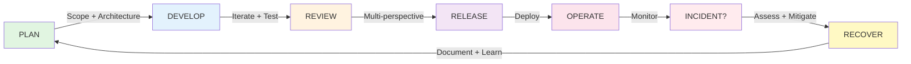
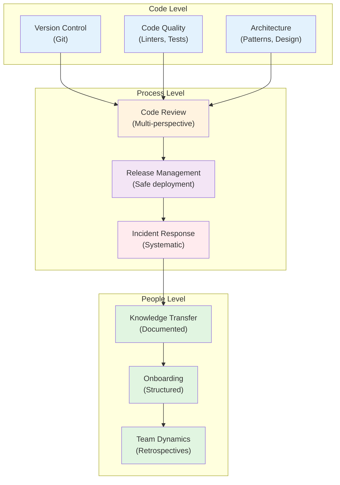

# Engineering Playbook: Making Quality the Default

## Introduction

Every engineering team faces the same challenges: preventing regressions, maintaining code quality across a growing codebase, onboarding new team members, responding to incidents, and shipping features without burning out. These are solved problems. Yet most teams reinvent the solutions over and over—in slightly different ways, each time losing efficiency.

The Engineering Playbook is a decision framework that codifies proven practices into structured, well-documented workflows. It's not a tool; it's a set of repeatable processes that work together to make quality the default, not something that requires heroic effort.

---

## The Problem We're Solving

Development teams typically struggle with:

**Quality Variability** — Code review rigor depends on who's reviewing. Some PRs get deep scrutiny; others barely get looked at. Testing practices differ by project. Standards aren't documented, so they're inconsistently applied.

**Context Loss** — Architectural decisions get made in Slack and forgotten. Six months later, someone asks "why did we design it this way?" and nobody remembers. New team members don't understand the reasoning behind major decisions.

**Incident Chaos** — When production breaks, the response depends on who's on call. There's no standard assessment process, no documented playbooks for different severity levels, no postmortem template. Teams repeat the same mistakes.

**Onboarding Friction** — New team members spend weeks or months learning unwritten cultural norms. "Here's how we do code review." "Here's how we do releases." "Here's the definition of done." All spoken, never documented.

**Distributed Team Challenges** — Async teams struggle with alignment. Standups don't work. Knowledge stays siloed. Reviews get blocked waiting for timezone-appropriate feedback.

**Knowledge Silos** — When key people leave, they take institutional knowledge with them. There's no systematic knowledge transfer process.

These problems aren't unique to your team. They're solved problems. The playbook gives you the solution, ready to adapt to your context.

---

## Why Existing Approaches Fall Short

Many teams try to solve these with:

**Heavy processes** — Mandatory meetings, extensive checklists, extensive documentation that nobody maintains. These reduce agility instead of improving quality.

**Light processes** — "Just use your judgment" and "communicate well." This works for 5-person teams but breaks down at scale. Without documentation, standards drift. New team members get inconsistent guidance.

**Off-the-shelf frameworks** — Scrum, Kanban, SAFe. These address *how* to organize work, not *how* to execute it well. They don't cover code quality, architectural decisions, incident response, or knowledge transfer.

**Tool-based solutions** — PR checklist bots, automated testing, linters. These catch some issues but can't replace judgment. They also create false confidence: "tests passed, so we're good," when actually test coverage is incomplete.

The playbook bridges this gap. It's a **structured framework** that enforces quality gates but remains **flexible** enough to adapt to your team's needs. It's **documented** so knowledge isn't lost. It's **integrated** so all the pieces work together as a system, not isolated commands.

---

## The Playbook Philosophy

The playbook is built on five core beliefs:

### 1. Quality Shouldn't Require Heroic Effort

Good processes make quality the default. The playbook instills review, testing, and security checks into every workflow—not as optional extras, but as built-in steps. This removes the question "should we review this?" (Answer: always.) It removes the question "should this be tested?" (Answer: always.)

When quality is the default, nobody has to argue for it.

### 2. Teams Learn Faster with Documented Patterns

Architectural decisions have reasons. Design patterns solve problems. These don't need to be reinvented. The playbook provides a pattern library for async systems, database optimization, distributed systems, and core architecture—with real-world examples and trade-offs documented.

Don't reinvent. Iterate on proven approaches.

### 3. Async-First Communication Scales Better

The playbook is designed for distributed teams. Instead of "let's sync up," it uses structured async patterns: decision records, standup templates, knowledge transfer checklists. Async-first doesn't mean no synchronous communication; it means documenting decisions so people can participate across time zones.

### 4. Multi-Perspective Review Catches More Issues

A single code reviewer can miss things. The playbook uses **five perspectives on every major piece of code**:
- **Code quality** — Architecture, patterns, maintainability
- **Security** — Input validation, secrets management, cryptography
- **Product alignment** — Does it match user needs?
- **Testing** — Coverage, edge cases, regression tests
- **Performance** — Bottlenecks, optimization opportunities

These perspectives catch different issues. A performance engineer might miss a security vulnerability. A security engineer might miss a test coverage gap. Together, they create a high bar for quality.

### 5. Structured Processes Enable Faster Iteration

Counterintuitive, but true: *more process, faster delivery*. Not because of the process itself, but because it reduces rework and prevents problems.

When you have a structured incident response process, you respond faster and make fewer mistakes. When you have documented architectural decisions, design reviews move faster because context is already there. When you have a testing framework, developers write fewer bugs and spend less time in QA cycles.

The playbook provides the structure. You decide how strictly to enforce it based on change size.

---

## How It Works: The Integrated System

The playbook isn't 45 independent commands. It's an **integrated system** where everything connects:

### Core Foundation
Three commands establish working principles that all others build on:

- `/pb-guide` — The SDLC framework with 11 phases and quality gates
- `/pb-standards` — Working principles and collaboration norms for your team
- `/pb-templates` — Reusable commit, PR, and testing templates

### Planning Before Building
Before writing code:

- `/pb-plan` — Define scope, acceptance criteria, success metrics, risks
- `/pb-adr` — Document architectural decisions with rationale and trade-offs
- `/pb-patterns` — Reference architectural patterns for your specific problem
- `/pb-observability` — Plan monitoring before implementation
- `/pb-performance` — Identify performance requirements upfront

### Iterative Development with Built-In Quality Gates
Code flows through the same review loop repeatedly:

- `/pb-start` — Create a feature branch with clear scope
- `/pb-cycle` — Self-review, then peer review, iterate
- `/pb-testing` — Unit, integration, end-to-end tests
- `/pb-security` — Security checklist
- `/pb-standards` — Code style and patterns
- `/pb-commit` — Atomic commits with meaningful messages
- `/pb-pr` — Pull request with context for reviewers

### Multi-Perspective Review
Different reviewers bring different lenses:

- `/pb-review-code` — Code quality and maintainability
- `/pb-security` — Security review
- `/pb-review-tests` — Test coverage
- `/pb-logging` — Logging standards
- `/pb-review-product` — Product alignment

### Safe Release
Before production:

- `/pb-release` — Pre-release checklist
- `/pb-review-prerelease` — Final gate by senior engineer
- `/pb-deployment` — Strategy choice (blue-green, canary, rolling)

### Incident Response
When things break:

- `/pb-incident` — Assessment, severity, mitigation, recovery
- `/pb-observability` — Monitoring and alerting strategy
- Post-incident review with `/pb-adr` to document lessons learned

### Team Operations
Scaling beyond one person:

- `/pb-standup` — Async daily standups for distributed teams
- `/pb-knowledge-transfer` — Structured knowledge transfer
- `/pb-onboarding` — Structured team member onboarding
- `/pb-team` — Retrospectives, feedback, growth



---

## Real-World Architecture: Where It Fits

The playbook sits at the intersection of **code**, **people**, and **process**:



### When to Apply Full Process
For large, architectural changes (L-tier), you use all 11 sections:

1. Intake & clarification
2. Scope lock
3. Design & trade-offs
4. Implementation plan
5. Development (with testing, security, standards)
6. Testing & QA
7. Documentation
8. Pre-release review
9. Deployment
10. Monitoring & alerting
11. Post-deployment verification

### When to Apply Lighter Process
For a simple bug fix (XS-tier), you use only the essential sections:

1. Brief intake (1 line in commit)
2. Fix the bug
3. Self-review
4. Atomic commit
5. Deploy and verify

The same playbook, right-sized to the change. No overhead for small changes. No skipped quality gates for any change.

---

## Key Design Decisions

### Decision 1: Why Change Tiers (XS / S / M / L)?

**What we chose**: Tier-based process that adjusts rigor based on change size.

**Rationale**:
- Typo fixes and bug fixes don't need the same overhead as architectural changes
- But all changes need quality gates (testing, review, documentation)
- Tier-based approach lets teams be fast on small changes and thorough on large ones
- It also makes the process transparent: "This change is M-tier, so we need tech lead approval"

**Alternative we rejected**:
- Single fixed process for all changes — too heavy for small changes, creates burnout
- No process — fast initially, but quality degrades at scale

### Decision 2: Why Multi-Perspective Review?

**What we chose**: Different reviewers (code, security, product, test, performance) instead of one person reviewing everything.

**Rationale**:
- A single reviewer is a bottleneck and also has blindspots
- A security engineer might miss test coverage gaps
- A performance engineer might miss design issues
- Different perspectives catch different issues
- For large changes, multiple reviewers provide redundancy: if one misses something, another catches it

**Alternative we rejected**:
- Single reviewer — faster but lower quality
- All reviewers always — slower, creates meetings bloat

### Decision 3: Why Documented Architectural Decisions?

**What we chose**: `/pb-adr` command for recording decisions with rationale, trade-offs, and lessons learned.

**Rationale**:
- Architectural decisions are made once but affect the codebase for years
- Without documentation, future team members don't understand "why" and make bad changes
- ADRs become institutional memory that survives team turnover
- Design reviews become faster when context is already documented

**Alternative we rejected**:
- Decisions in Slack — Lost when channel scrolls, no context for future developers
- Comments in code — Doesn't scale, gets out of sync
- Wiki — Often abandoned, outdated, nobody knows where to look

### Decision 4: Why Async-First for Distributed Teams?

**What we chose**: Structured async communication (standups, PRs, knowledge transfer) instead of sync meetings.

**Rationale**:
- Sync meetings don't work well across 8+ time zones
- Async communication forces documentation, creating a record
- Async-first doesn't mean no sync meetings; it means sync is intentional, not default
- People can think through complex topics instead of having to respond in real-time
- Time zones become irrelevant

**Alternative we rejected**:
- Sync meetings for everything — 8am one timezone is 6pm another
- Async communication with no structure — Decisions get lost, context disappears

### Decision 5: Why Checkpoints Instead of Continuous Deployment?

**What we chose**: Structured gates (scope lock, design approval, release approval) instead of pushing every commit straight to production.

**Rationale**:
- Gates catch mistakes before they reach production
- They create opportunities for feedback on approach before implementation
- They provide a paper trail for audits and incident investigation
- They're checkpoints, not blocks: a good design review takes 1 hour and prevents 2 weeks of rework

**Alternative we rejected**:
- No gates (continuous deployment) — Fast but mistakes reach production
- Heavy gates (multiple sign-offs) — Slower, creates bottlenecks

---

## When to Use the Playbook

### Excellent Fit
- **New teams** establishing culture and practices from day one
- **Growing teams** (5 → 50+ people) that need to scale processes
- **Distributed teams** working across time zones
- **High-quality codebases** where mistakes are expensive
- **Claude Code users** developing with AI assistance
- **Organizations** wanting to codify and transfer institutional knowledge

### Not Ideal For
- **Tiny teams** (< 3 people) — Overhead outweighs benefits
- **Prototypes** that will be thrown away — Too much documentation
- **Teams with deeply established workflows** that work well — Migration cost too high
- **Language-specific frameworks** you're deeply committed to (domain-specific commands exist but not comprehensive)

### Starting Points
- **Greenfield project**: Follow Scenario 1 (plan → architecture → develop → release)
- **Existing codebase**: Follow Scenario 2 (audit → establish baseline → integrate gradually)
- **Individual developer**: Use individual commands as needed; build as you grow
- **Distributed team**: Start with `/pb-standup`, `/pb-knowledge-transfer`, `/pb-adr`

---

## Measuring Success

The playbook's value shows up in:

**Faster Code Review**
- With documented architecture, reviewers don't need to ask "why is it designed this way?"
- With clear standards, reviewers don't need to nitpick style
- Multi-perspective review happens in parallel, not sequentially

**Fewer Regressions**
- Quality gates (testing, security, documentation) catch issues before production
- Atomic commits make it easy to identify which change broke something
- Documented decisions prevent breaking changes from architectural misunderstandings

**Easier Onboarding**
- New team members read `/pb-guide` and understand the SDLC
- ADRs explain "why" for every major decision
- Structured standup templates and knowledge transfer process accelerate knowledge sharing

**Faster Incident Response**
- `/pb-incident` provides a systematic assessment process
- Pre-documented rollback steps mean faster recovery
- Postmortem template ensures lessons are captured

**Lower Burnout**
- Structured processes mean less "how do we do this?" Slack threads
- Clear quality gates mean less endless revision cycles
- Async-first communication means less context-switching across time zones

---

## Implementation Philosophy

The playbook isn't a "fork and use" system. It's a "fork, read, adapt, and use" system.

Each command includes:
- **How it works** — Concrete steps and examples
- **Why we do it** — Rationale and philosophy
- **Where to customize** — Instructions on adapting to your team

Your team's context matters:
- **Size** — XS team vs. 100-person org
- **Domain** — Security-critical vs. user-facing frontend
- **Maturity** — Greenfield vs. 10-year-old codebase
- **Culture** — Startup vs. enterprise vs. open source

The playbook provides the framework. You adjust the rigor based on context.

---

## What's Included

### 45 Commands Across 9 Categories

**Core Foundation** — `/pb-guide`, `/pb-standards`, `/pb-documentation`, `/pb-templates`

**Planning** — `/pb-plan`, `/pb-adr`, `/pb-patterns*` (4 families), `/pb-performance`, `/pb-observability`, `/pb-deprecation`

**Development** — `/pb-start`, `/pb-cycle`, `/pb-resume`, `/pb-commit`, `/pb-pr`, `/pb-testing`, `/pb-standup`, `/pb-todo-implement`, `/pb-knowledge-transfer`

**Review** — `/pb-review*` (8 commands), `/pb-security`, `/pb-logging`

**Release** — `/pb-release`, `/pb-deployment`, `/pb-incident`

**Repository** — `/pb-repo*` (5 commands)

**Team** — `/pb-onboarding`, `/pb-team`

**Reference** — `/pb-context`

### Documentation
- Command reference with examples
- Integration guide showing how all 45 commands work together
- Decision guide (decision tree for "which command should I use?")
- Getting started guide with 5 real-world scenarios
- Best practices and checklists

### Ready to Install
```bash
git clone https://github.com/vnykmshr/playbook.git
cd playbook
./scripts/install.sh  # Creates symlinks in ~/.claude/commands/
```

All commands are immediately available in Claude Code.

---

## The Bigger Picture

Engineering teams face the same challenges repeatedly. The Playbook solves them by:

1. **Codifying proven practices** — Don't invent, iterate
2. **Documenting the "why"** — Future decisions are informed by past decisions
3. **Integrating systems** — Commands work together, not in isolation
4. **Right-sizing rigor** — Lightweight process for small changes, thorough for large
5. **Scaling asynchronously** — Distributed teams stay aligned without constant meetings

The result is a team that ships faster, maintains higher quality, responds to incidents better, and burns out less.

Quality becomes the default. Not because of individual heroics, but because good practices are built into how work gets done.

---

## Getting Started

Pick your scenario:

**[Scenario 1: New Project →](/getting-started.md#scenario-1-starting-a-new-project)**
From greenfield to production with clear architecture and quality gates.

**[Scenario 2: Existing Codebase →](/getting-started.md#scenario-2-adopting-playbook-in-existing-project)**
Gradually adopt playbook practices without disrupting current flow.

**[Scenario 3: Daily Developer Workflow →](/getting-started.md#scenario-3-typical-developer-day)**
See how a developer uses the playbook during a typical day.

**[Scenario 4: Code Review →](/getting-started.md#scenario-4-code-review)**
Structure code review from multiple perspectives.

**[Scenario 5: Incident Response →](/getting-started.md#scenario-5-incident-response)**
Respond to production issues systematically.

Or browse the [full command reference](/command-index.md) and [decision guide](/decision-guide.md).

---

**The playbook isn't just documentation. It's a decision framework that makes good development practices the default.**
